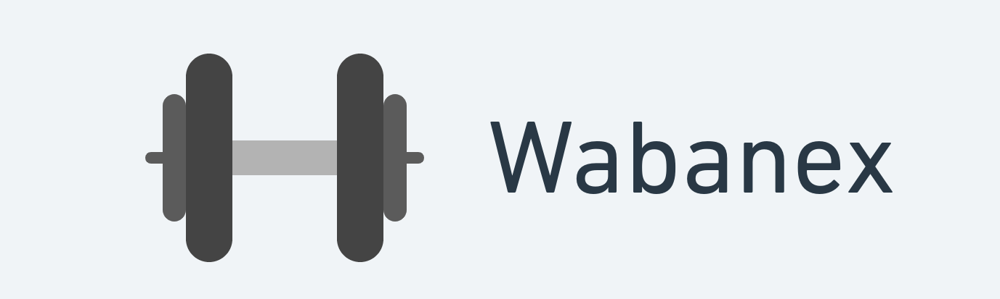
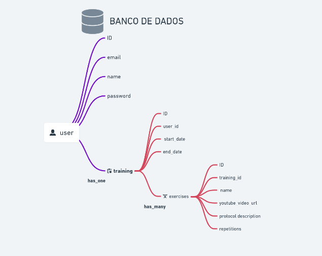

  

&nbsp;

  <a href="#techs">Tecnologias</a>&nbsp;&nbsp;&nbsp;|&nbsp;&nbsp;&nbsp;
  <a href="#project">Projeto</a>&nbsp;&nbsp;&nbsp;|&nbsp;&nbsp;&nbsp;
  <a href="#how-use">Como usar</a>&nbsp;&nbsp;&nbsp;|&nbsp;&nbsp;&nbsp;
  <a href="#mit">Licença</a>

&nbsp;&nbsp;&nbsp;

## ✨ Tecnologias

Esse projeto foi desenvolvido com as seguintes tecnologias:

- [Elixix](https://elixir-lang.org/)
- [Phoenix](https://phoenixframework.org/)
- [GraphQL](https://graphql.org)

## 💻 Projeto

Gerencie e acompanhe seus treinos na academia

&nbsp;&nbsp;&nbsp;

  

&nbsp;&nbsp;&nbsp;

## 🚀 Como executar

- Clone o repositório
- Instale o phoenix `mix archive.install hex phx_new 1.5.9`
- Instale as dependencias do projeto `mix deps.get`
- Instale a database e rode as migrations `mix ecto.setup`
- Inicie o servidor do phoenix `mix phx.server`
- Por fim, caso precise você pode alterar as configurações do banco de dados pelo arquivo `dev.exs` e no arquivo `config/test.exs`

Por fim, a aplicação estará disponível em `http://localhost:4000`

---

## 📄 Licença

Esse projeto está sob a licença MIT. Veja o arquivo [LICENSE](LICENSE.md) para mais detalhes.

&nbsp;

<h1 align="center">
    
</h1>

&nbsp;

Feito com 💜 by Rocketseat 👋🏻 [Participe da nossa comunidade!](https://discordapp.com/invite/gCRAFhc)

